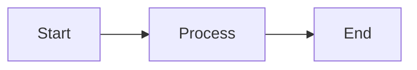
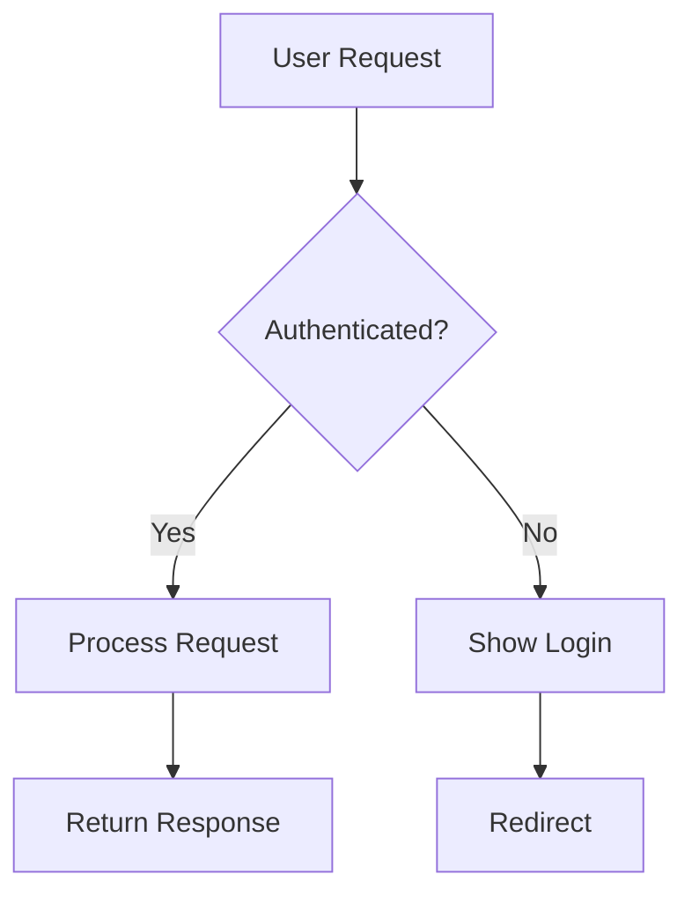
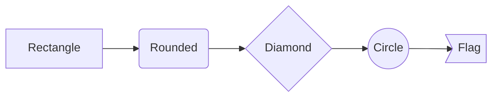
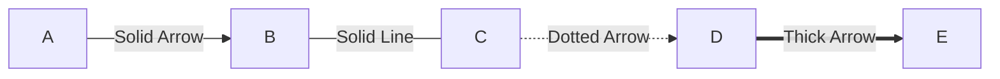
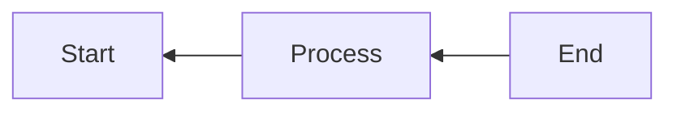
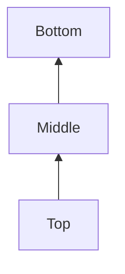
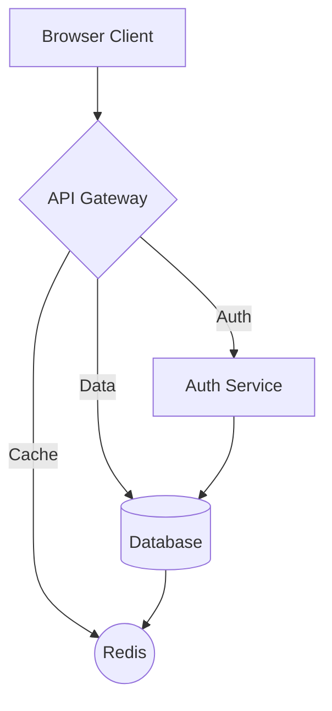
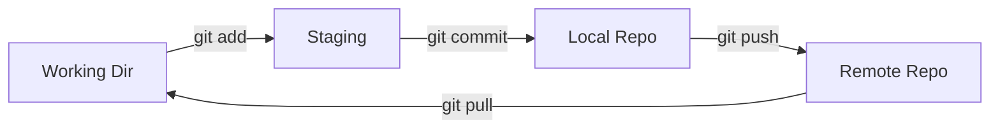

# Mermaid Diagram Examples

This file demonstrates termflow's Mermaid diagram rendering capabilities.

## Simple Flowchart

A basic left-to-right flowchart:

## Decision Tree

A top-down decision flowchart with conditional branches:

## Different Node Shapes

Showcasing all available node shapes:

**Shape Reference:**
- `[text]` - Rectangle
- `(text)` - Rounded rectangle
- `{text}` - Diamond (decision)
- `((text))` - Circle
- `>text]` - Flag/asymmetric

## Edge Styles

Different edge/arrow styles:

**Edge Reference:**
- `-->` - Solid line with arrow
- `---` - Solid line without arrow
- `-.->` - Dotted line with arrow
- `==>` - Thick line with arrow

## Right to Left

Graphs can flow in different directions:

## Bottom to Top

## Complex Example

A more realistic software architecture example:

## Git Workflow

---

*Render this file with: `tf examples/mermaid.md`*
